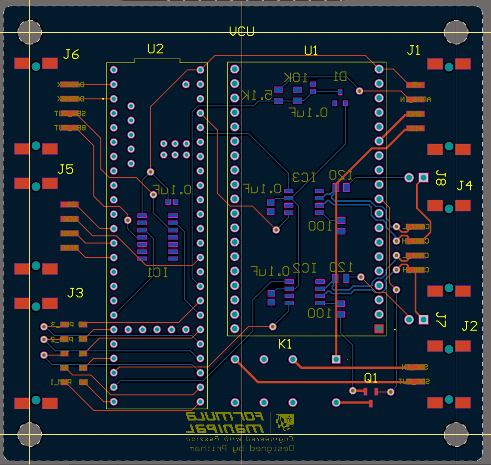
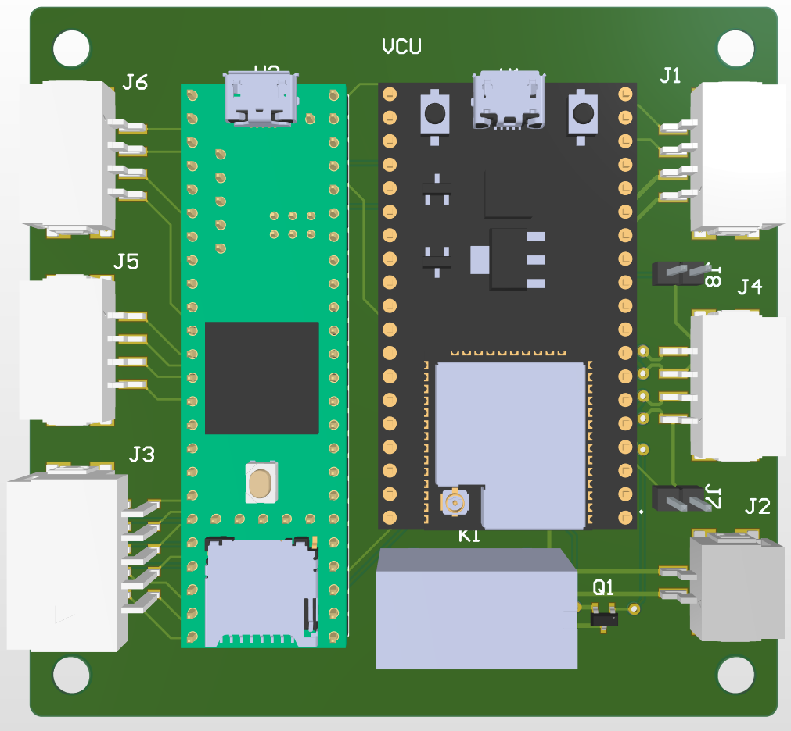
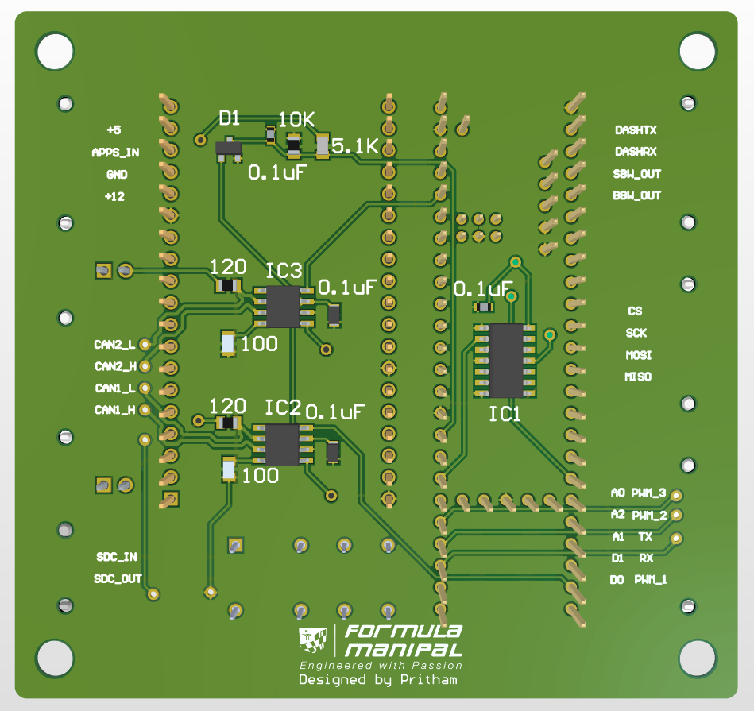

# VCU — Vehicle Control Unit

The VCU (Vehicle Control Unit) is a custom-designed PCB built for embedded vehicle systems. 
It integrates motor control, multi-protocol communication, real-time data logging, and wireless 
telemetry into a single compact board.

## Features

- **Motor Control** — Drive and regulation of motor output with configurable control logic
- **CAN Bus** — CAN protocol for communicating with other modules
- **UART** — Serial communication for peripherals, debugging, and configuration
- **SPI** — SPI Interface for Dashboard Display Communication
- **Data Logging** — Onboard logging of sensor and system data for post-analysis
- **Telemetry** — Real-time wireless data transmission via ESP32 for live monitoring and diagnostics
- **Remote Shutdown Circuit** — Remotely activated shutdown that cuts current to the AIRs (Accumulator 
  Isolation Relays), and pre-charge circuitry

## Hardware

| Parameter | Details |
|-----------|---------|
| Form factor | Custom PCB |
| MCUs | Teensy + ESP32 |
| Communication | CAN bus, UART, SPI |
| Telemetry | Wi-Fi / Bluetooth via ESP32 |
| Safety | Remote shutdown circuit — cuts AIR drive current (EV5.6 compliant) |
| PCB layers | 2-layer |
| Board dimensions | 80mm × 84mm |
| Connectors | Erni Maxibridge |
| Data storage | MicroSD on the Teensy 4.1 |

## PCB

  
  &nbsp;&nbsp;

  <em>VCU rev1.0</em>

## 3D View

  
  &nbsp;&nbsp;
  

  <em>VCU rev1.0 — 3D render from Altium</em>

